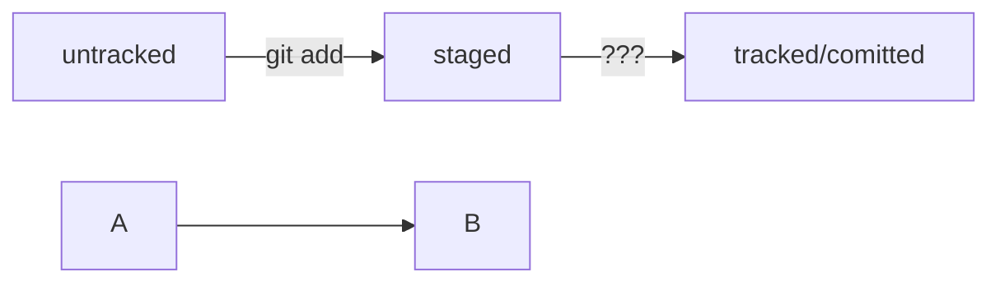

# Second project
---
1. Наконец-то создал свой первый репозиторий
2. Узнал как коммитить, пушить
3. Узнал базовые команды, чтобы хоть как то пользоваться терминалом
4. Тяжело запомнить все команды, даже если очень хочется
5. Практика. практика. практика.
6. Хеш хранит информацию о коммитах
7. Лог может быть полным и коротким
8. HEAD - последний коммит, хранит его инфу и путь
9. Статусы коммита бывают разные и могут иметь сразу несколько статусов

HEAD -- это голова.
Коммит -- это всему голова.
Статусы файлов:
<тут пустая строка!>

